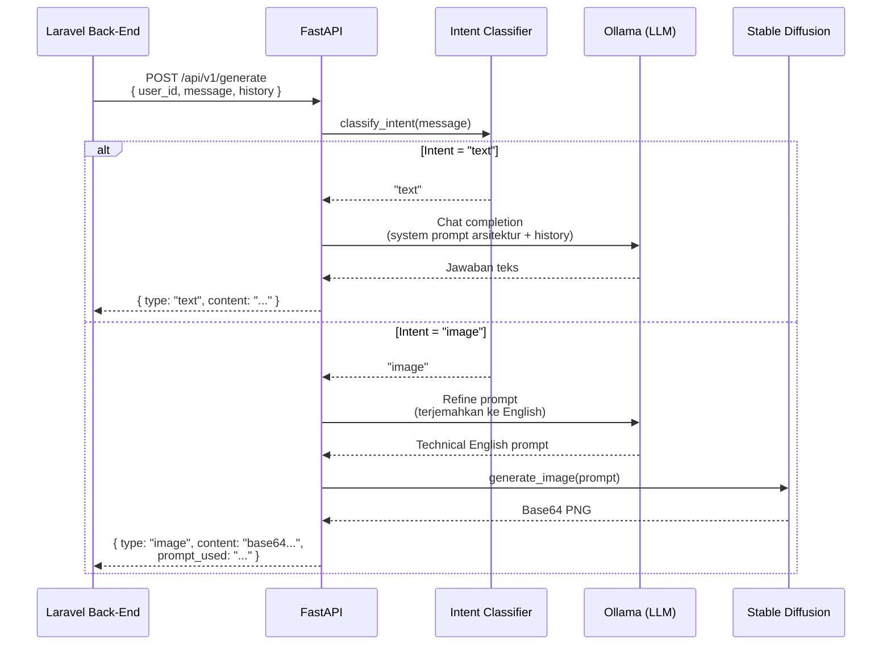

# 🏗️ HaloSitek AI Microservice — Arsitektur & Tech Stack

## Deskripsi Singkat

HaloSitek AI Microservice adalah layanan AI mandiri yang berjalan di server lokal sebagai bagian dari ekosistem platform konsultasi arsitektur **HaloSitek**. Service ini menerima request dari back-end Laravel, memproses teks menggunakan Local LLM, memproses gambar menggunakan Diffusion Model, lalu mengembalikan hasilnya.

---

## Arsitektur Sistem (Ekosistem HaloSitek)

```
┌──────────────┐       ┌──────────────────┐       ┌─────────────────────────────────┐
│              │       │                  │       │     AI MICROSERVICE (Python)     │
│   Flutter    │◄─────►│   Laravel API    │◄─────►│                                 │
│  Mobile App  │ HTTP  │   (Back-End)     │ REST  │  ┌───────────────────────────┐   │
│              │       │                  │  JSON │  │   FastAPI Application     │   │
└──────────────┘       └──────────────────┘       │  │                           │   │
                              │                   │  │  ┌─────────────────────┐  │   │
                              │                   │  │  │ Intent Classifier   │  │   │
                              ▼                   │  │  └────────┬────────────┘  │   │
                       ┌──────────────┐           │  │           │              │   │
                       │   MongoDB    │           │  │     ┌─────┴──────┐       │   │
                       │  (Database)  │           │  │     ▼            ▼       │   │
                       └──────────────┘           │  │ ┌────────┐ ┌─────────┐  │   │
                                                  │  │ │ Ollama │ │Diffusers│  │   │
                                                  │  │ │ (LLM)  │ │ (SDXL)  │  │   │
                                                  │  │ └────────┘ └─────────┘  │   │
                                                  │  └───────────────────────────┘   │
                                                  └─────────────────────────────────┘
```

---

## Tech Stack

### 1. Framework API — FastAPI

| Item | Detail |
|------|--------|
| Library | `fastapi` v0.115.6 |
| Server ASGI | `uvicorn` v0.34.0 |
| Python | 3.10+ |
| Validasi Data | `pydantic` v2.10 + `pydantic-settings` |

FastAPI dipilih karena:
- **Async-native** — mendukung `async/await` untuk I/O non-blocking ke Ollama.
- **Auto-generated docs** — Swagger UI otomatis di `/docs`.
- **Type-safe** — validasi request/response otomatis via Pydantic.

### 2. Text Engine (LLM) — Ollama + Llama 3

| Item | Detail |
|------|--------|
| Runtime | Ollama (localhost:11434) |
| Model Target | Meta Llama 3 8B / Mistral 7B |
| Protokol | REST API (`/api/chat`) |
| HTTP Client | `httpx` v0.28 (async) |

Ollama menjalankan LLM secara lokal tanpa bergantung pada API pihak ketiga. Dua fungsi utama:
- **Jawab teks arsitektural** — menggunakan system prompt domain spesifik.
- **Refine image prompt** — menerjemahkan deskripsi pengguna (Bahasa Indonesia) menjadi prompt teknis Bahasa Inggris untuk Stable Diffusion.

### 3. Image Engine — Stable Diffusion XL Turbo

| Item | Detail |
|------|--------|
| Library | `diffusers` v0.32 (Hugging Face) |
| Model | `stabilityai/sdxl-turbo` |
| Inference Steps | 1–4 steps (optimized for speed) |
| Output | PNG → Base64 encoded string |
| Pendukung | `transformers`, `accelerate`, `torch` |

SDXL Turbo dipilih karena mampu menghasilkan gambar berkualitas hanya dalam **1–4 langkah inferensi** (vs 20–50 langkah pada SD biasa), sehingga cocok untuk penggunaan real-time.

### 4. Format Komunikasi

| Item | Detail |
|------|--------|
| Protokol | REST API (HTTP POST) |
| Format Payload | JSON murni |
| Encoding Gambar | Base64 (dalam field JSON) |

---

## Alur Request (Sequence)



---

## Struktur File Proyek

```
Tubes ABP AI/
├── main.py                    # Entry point, endpoint /api/v1/generate & /health
├── config.py                  # Konfigurasi terpusat (Pydantic Settings + .env)
├── schemas.py                 # Model request (GenerateRequest) & response (GenerateResponse)
├── requirements.txt           # Daftar dependensi Python
├── .env.example               # Template environment variables
├── dataset_halositek.jsonl    # Dataset FAQ arsitektur (untuk fine-tuning)
└── services/
    ├── __init__.py
    ├── intent_classifier.py   # Klasifikasi intent keyword-based (teks vs gambar)
    ├── ollama_service.py      # Client async ke Ollama /api/chat
    └── image_generator.py     # Pipeline SDXL Turbo (lazy-loaded singleton)
```

---

## API Contract

### `POST /api/v1/generate`

**Request Body:**
```json
{
  "user_id": "string",
  "message": "string",
  "history": [
    { "role": "user", "content": "string" },
    { "role": "assistant", "content": "string" }
  ]
}
```

**Response (Teks):**
```json
{
  "type": "text",
  "content": "Jawaban teks dari LLM...",
  "prompt_used": null
}
```

**Response (Gambar):**
```json
{
  "type": "image",
  "content": "data:image/png;base64,iVBOR...",
  "prompt_used": "A minimalist 2-story house floor plan, architectural rendering, top view..."
}
```

### `GET /health`

```json
{
  "status": "healthy",
  "ollama_connected": true,
  "model": "llama3",
  "sd_model": "stabilityai/sdxl-turbo"
}
```

---

## Ringkasan Dependensi

| Package | Versi | Fungsi |
|---------|-------|--------|
| `fastapi` | 0.115.6 | Framework API utama |
| `uvicorn` | 0.34.0 | ASGI server |
| `pydantic` | 2.10.4 | Validasi data |
| `pydantic-settings` | 2.7.1 | Konfigurasi dari .env |
| `httpx` | 0.28.1 | HTTP client async (Ollama) |
| `diffusers` | 0.32.2 | Pipeline Stable Diffusion |
| `transformers` | 4.47.1 | Tokenizer & model utils |
| `accelerate` | 1.2.1 | Optimisasi loading model |
| `torch` | ≥2.1.0 | Backend komputasi tensor |
| `Pillow` | 11.1.0 | Konversi gambar → base64 |
| `python-dotenv` | 1.0.1 | Load .env file |
