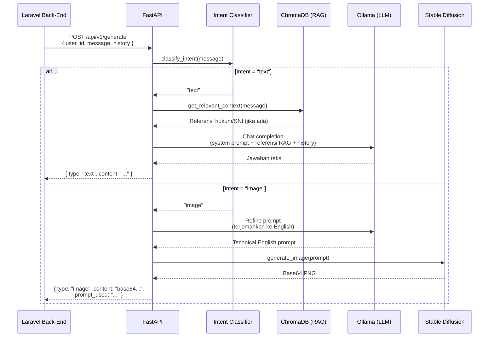

# 🏗️ HaloSitek AI Microservice — Arsitektur & Tech Stack

## Deskripsi Singkat

HaloSitek AI Microservice adalah layanan AI mandiri yang berjalan di server lokal sebagai bagian dari ekosistem platform konsultasi arsitektur **HaloSitek**. Service ini menerima request dari back-end Laravel, memproses teks menggunakan Local LLM yang **dilengkapi RAG (Retrieval-Augmented Generation)**, memproses gambar menggunakan Diffusion Model, lalu mengembalikan hasilnya.

---

## Arsitektur Sistem (Ekosistem HaloSitek)

```
┌──────────────┐       ┌──────────────────┐       ┌───────────────────────────────────────┐
│              │       │                  │       │       AI MICROSERVICE (Python)         │
│   Flutter    │◄─────►│   Laravel API    │◄─────►│  ┌─────────────────────────────────┐   │
│  Mobile App  │ HTTP  │   (Back-End)     │ REST  │  │       FastAPI Application       │   │
│              │       │                  │  JSON │  │  ┌───────────────────────────┐  │   │
└──────────────┘       └──────────────────┘       │  │  │     Intent Classifier     │  │   │
                              │                   │  │  └────────┬──────────┬───────┘  │   │
                              │                   │  │           │          │          │   │
                              ▼                   │  │   [Teks]  ▼          ▼ [Gambar] │   │
                       ┌──────────────┐           │  │ ┌───────────┐ ┌───────────────┐ │   │
                       │   MongoDB    │           │  │ │ RAG System│ │Ollama(Refiner)│ │   │
                       │  (Database)  │           │  │ │(ChromaDB) │ │               │ │   │
                       └──────────────┘           │  │ └─────┬─────┘ └──────┬────────┘ │   │
                                                  │  │       ▼              ▼          │   │
                                                  │  │ ┌───────────┐ ┌───────────────┐ │   │
                                                  │  │ │ Ollama    │ │  Diffusers    │ │   │
                                                  │  │ │ (LLM)     │ │  (SDXL Turbo) │ │   │
                                                  │  │ └───────────┘ └───────────────┘ │   │
                                                  │  └─────────────────────────────────┘   │
                                                  └───────────────────────────────────────┘
```

---

## Tech Stack

### 1. Framework API — FastAPI

| Item | Detail |
|------|--------|
| Library | `fastapi` v0.115.6 |
| Server ASGI | `uvicorn` v0.34.0 |
| Python | 3.10+ |
| Validasi Data | `pydantic` v2.10 + `pydantic-settings` |

### 2. RAG System (Aturan Bangunan)

| Item | Detail |
|------|--------|
| Library | `langchain`, `langchain-chroma`, `pypdf` |
| Vector Database | ChromaDB (Lokal di folder `chroma_db`) |
| Embeddings | `langchain-ollama` dengan model `nomic-embed-text` |
| Fungsi | Mengambil paragraf spesifik dari dokumen PDF hukum/aturan untuk disisipkan ke LLM |

### 3. Text Engine (LLM) — Ollama + Llama 3

| Item | Detail |
|------|--------|
| Runtime | Ollama (localhost:11434) |
| Model Target | Meta Llama 3 8B / Mistral 7B |
| Protokol | REST API (`/api/chat`) |
| Fungsi | Menjawab teks (dilengkapi referensi RAG) dan memoles prompt gambar |

### 4. Image Engine — Stable Diffusion XL Turbo

| Item | Detail |
|------|--------|
| Library | `diffusers` v0.32 (Hugging Face) |
| Model | `stabilityai/sdxl-turbo` |
| Inference Steps | 1–4 steps (optimized for speed) |
| Output | PNG → Base64 encoded string |

---

## Alur Request (Sequence)



---

## Struktur File Proyek

```
Tubes ABP AI/
├── main.py                    # Entry point, endpoint /api/v1/generate & /health
├── config.py                  # Konfigurasi terpusat (Pydantic Settings + .env)
├── schemas.py                 # Model request & response
├── requirements.txt           # Daftar dependensi Python
├── dataset_halositek.jsonl    # Dataset FAQ arsitektur (untuk fine-tuning)
├── ingest_documents.py        # Script untuk membaca PDF & membuat database RAG
├── Dokumen Aturan Bangunan/   # Folder berisi PDF sumber RAG
├── chroma_db/                 # Folder hasil database vektor
└── services/
    ├── intent_classifier.py   # Klasifikasi intent (teks vs gambar)
    ├── rag_service.py         # Modul pencarian referensi dari ChromaDB
    ├── ollama_service.py      # Client async ke Ollama
    └── image_generator.py     # Pipeline SDXL Turbo
```

---

## API Contract

*(Sama persis seperti dokumentasi awal. API tidak mengalami perubahan dari segi request/response meskipun di backend sudah dilengkapi RAG)*

### `POST /api/v1/generate`

**Request Body:**
```json
{
  "user_id": "string",
  "message": "string",
  "history": []
}
```

---

## Ringkasan Dependensi

| Package | Fungsi |
|---------|--------|
| `fastapi`, `uvicorn` | Framework API utama dan server |
| `pydantic`, `pydantic-settings` | Validasi data dan konfigurasi |
| `httpx` | HTTP client async (Ollama) |
| `langchain`, `langchain-chroma` | Framework RAG dan Vector DB lokal |
| `langchain-ollama` | Koneksi untuk model embedding Ollama |
| `pypdf` | Pembaca dokumen PDF sumber |
| `diffusers`, `transformers` | Pipeline Stable Diffusion untuk gambar |
| `torch`, `accelerate` | Backend komputasi dan optimisasi model |
